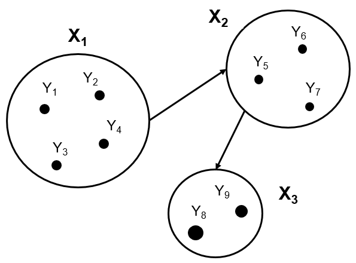

# Group Causal Discovery using Model Invariance (gCDMI)

This repository contains code for our work on estimating causal influence among subsystems.

- The work on causal inference within groups can be cited using below citation information.

```
@article{ahmad2024deep,
  title={Deep Learning-based Group Causal Inference in Multivariate Time-series},
  author={Ahmad, Wasim and Shadaydeh, Maha and Denzler, Joachim},
  journal={arXiv preprint arXiv:2401.08386},
  year={2024}
}
```


## Overview

We discover full causal graph in multivariate nonlinear systems by testing model invariance against Knockoffs-based interventional environments:
1. First we train deep network $f_i$ using data from observational environment $E_i$.
2. Then we expose the model to Knockoffs-based interventional environments $E_k$. 
3. For each pair variables ${z_i, z_j}$  in nonlinear system, we test model invariance across environments. 
4. We perform KS test over distribution $R_i$, $R_k$ of model residuals in various environments. Our NULL hypothesis is that variable $z_i$ does not cause $z_j$, $H_0$: $R_i$ = $R_k$, else the alternate hypothesis $H_1$: $R_i$ != $R_k$ is accepted.

<p align="center">

</p>

## Data
We test our method on synthetic as well as real data which can be found under `datasets/` directory. The synthetic data is generated using file `src/synthetic_dataset.py`.


## Code
`src/main.py` is our main file, where we model multivariate non-linear data using deep networks.
- `src/deepcause.py` for actual and counterfactual outcome generation using interventions.
- `src/preprocessing.py` for data loading and preprocessing.
- `src/knockoffs.py` generate knockoffs of the original variables.
- `src/daignostics.py` to determine the goodness of the generated knockoff copies.
- `DeepKnockoffs/` contains the knockoffs generation methods.
- `datasets/` contains the generated synthetic data and real dataset.
- `model/` contains trained models that we used for different datasets.


## Dependencies
`requirement.yml` contains all the packages that are related to the project.
To install them, simply create a new [conda](https://docs.conda.io/en/latest/) environment and type
```
conda env create -f environment.yml
```


## Acknowledgement

This work is funded by the Carl Zeiss Foundation within the scope of the program line "Breakthroughs: Exploring Intelligent Systems" for "Digitization � explore the basics, use applications" and the DFG grant SH 1682/1-1.
